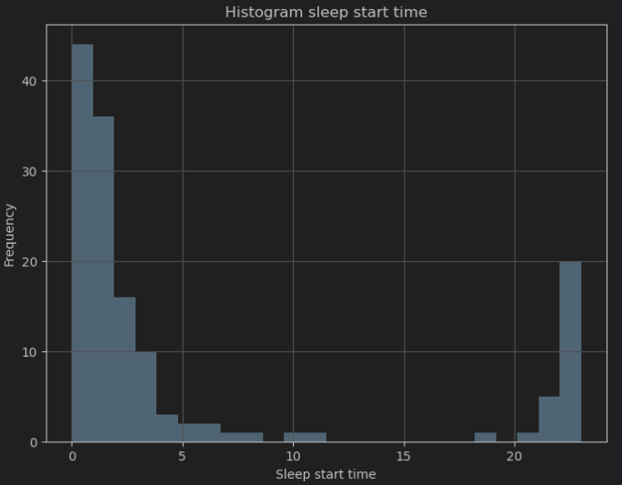
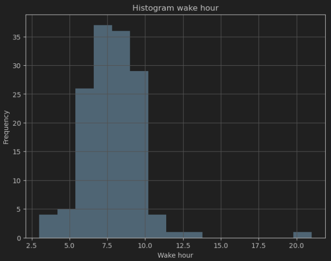
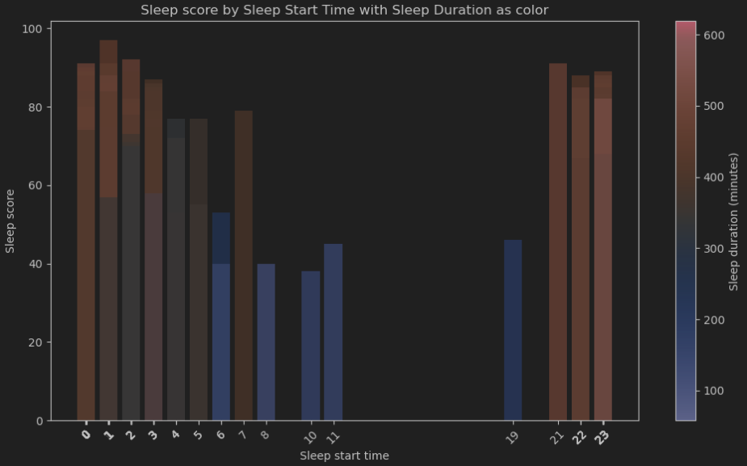

# Sleep Data Analysis from Samsung Health

This repository contains a brief analysis of my sleeping habits using visualizations. The data comes from my [Samsung Galaxy Watch](https://www.samsung.com/us/watches/galaxy-watch6-classic/) and the [Samsung Health App](https://www.samsung.com/ar/apps/samsung-health/#Sleep)

## Preview

## Useful links

[How to download your personal data from Samsung Health](https://www.samsung.com/us/support/answer/ANS00085104/)

[A Note on Long Labels](https://www.data-to-viz.com/caveat/hard_label.html)